# Hygi0Quizz
*Un jeu de Quiz développé en [HTML/Javascript-jQuery] visant à apprendre les recommandations d'hygiene et s'y entraîner en tant que professionnel*

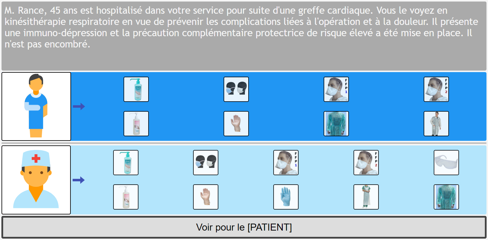

## I) Explications
Le but de cette application est d'apprendre facilement les recommandations d'hygiene d'une structure de santé.  
J'ai pu remarquer que l'application des mesure d'hygiène par les opérateurs au sein de structures de santé est quelque chose de compliqué, en particulier du fait de 3 facteurs:  
1) L'apprentissage des recommandations d'hygiène par les opérateurs, tâche qui peut être difficile et laborieuse
2) La discordance entre les recommandations  théoriques et la réalité du terrain, quand l'échelle de valeur des recommandations ne rejoint pas celles des opérateurs
3) Les difficultés logistiques à appliquer les recommandations, du fait d'un manque de temps ou de moyens

Cette application a pour but de résoudre le premier point en **diminuant l'énergie nécessaire à apprendre les recommandations**, en utilisant des cas concrets et une approche d'apprentissage de type "essai-erreur", le tout dans une application web qui se veut amusante.
Cette application a également pour but de d'affecter positivement le second point cité en **encourageant le dialogue entre les opérateurs et l'équipe d'hygiène**, à propos des cas spécifiques décris, d'impossibilités logistiques d'appliquer les réponses proposées, de divergence d'échelles de valeurs, etc.

## II) Informations techniques 
Hygi0Quizz est une application web exclusivement front-end, utilisant HTML et jQuery. Ce choix a été fait afin d'obtenir un outil très simple à déployer. Point besoin de connexion internet ou de serveur sur lequel placer l'application, la seule chose nécessaire est un navigateur web (chrome, firefox, internet explorer, ...). Vous placez le répertoire sur l'ordinateur, lancez le fichier "Hygi0Quizz.htm" dans un navigateur web et vous jouez, c'est tout.  
  
Il y a 2 parties dans l'application: 
- Une **partie quiz**, incarnée par le fichier **"quizzes.js"**, qui contient tous les quizs et les explications de chaque réponse, sous la forme d'un objet JS, fichier qui peut être modifé manuellement ou avec un outil simplificateur, afin de mettre à jour les quizs et les réponses en fonction de l'évolution des recommandations *(un outil visant à générer le fichier quizzes.js depuis une simple interface graphique arrive bientôt !)*
- Une **partie technique**, constituée par les fichiers nécessaire au fonctionnement propre de l'application (Hygi0Quizz.htm, checkQuizzes.htm, ./resources/\*), qui n'ont pas besoin d'être modifiés de prime abord.

Pour information, le fichier **Hygi0Quizz.htm** est le fichier permettant de lancer l'application de quizs d'entraînement, tandis que le fichier **checkQuizzes.htm** est un fichier permettant de voir tous les quizs et les réponses à ces derniers. Son utilisation est détaillée dans la partie **Comment l'utiliser** . 

## III) Installation
- Étape 1: Téléchargez le fichier en cliquant sur le bouton "Clone or download", et dé-compressez le dans le dossier que vous voulez (disons yourFolder par exemple)
- Étape 2: Créez sur votre bureau un raccourci vers yourFolder/HygioQuizz/src/Hygi0Quizz.htm afin de simplifier le lancement de l'application
- Étape 3: Modifiez le fichier quizzes.js (*situé dans yourFolder/HygioQuizz/src/quizzes.js*) avec votre éditeur de texte favori, afin de définir vos propres questions et réponses
- Étape 4: Cliquez sur le raccourci que vous venez de créer afin de lancer l'application et jouez autant que vous voulez

## IV) Comment l'utiliser
### IV.1) Fonctionnalité Hygi0Quizz :
C'est le **Jeu de Quizz**. Quand vous le lancez, il se présente comme suit:
  
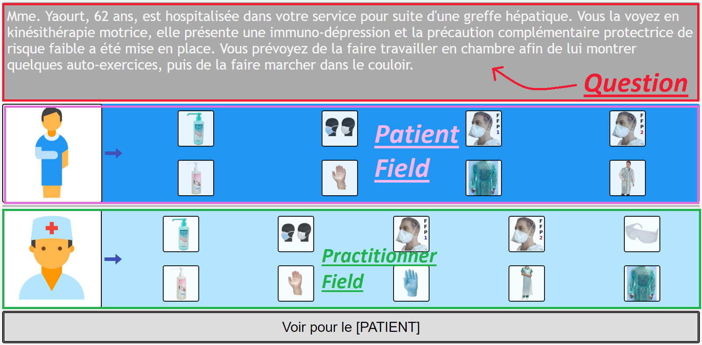  
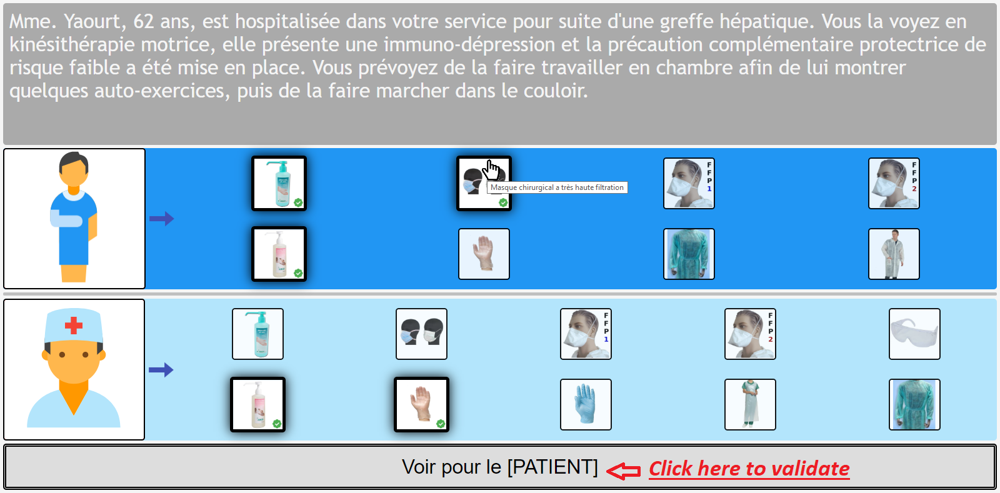  
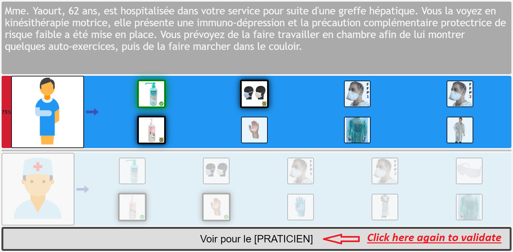  
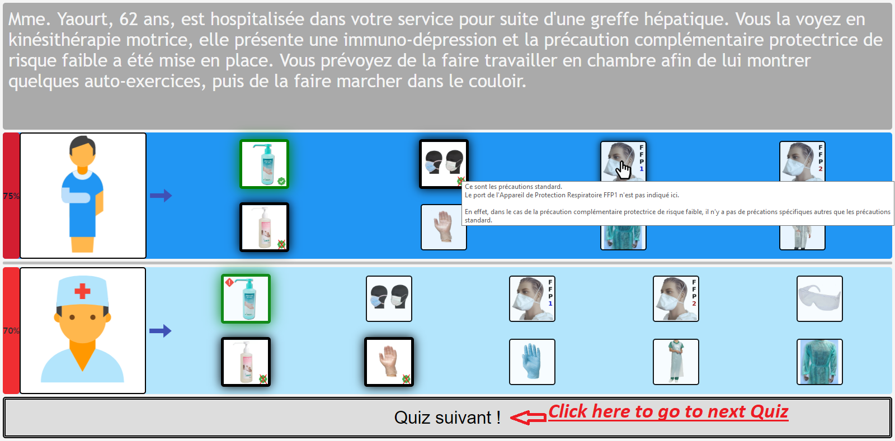  

#### IV.1.1) Voici ce qu'il faut savoir:  
1)  Il y a une situation concrète / question décrite en haut de la page.  
  
2)  Il y a 2 champs: un **champs Patient**, et un **champs Praticien**.  
  
3)  Vous devez **cliquer sur les équipements que vous recommandez** pour le patient dans **le champs Patient**, et sur les équipements que vous recommandez pour le praticien dans le **champs Praticien**. Vous pouvez survoler avec la souris un item pour voir le détail de l'équipement dans une  **info-bulle**.    
  
4) Quand vous **validez** votre réponse en cliquant sur le bouton **_"Voir pour le [PATIENT]"_**, cela va montrer les réponses attendues pour le champs patient. Vous pouvez obtenir des explicatiosn détaillées sur chaque réponse dans une **info-bulle** en survolant l'item avec la souris.
- Si l'icône équipement que vous avez selectionnée est correcte, elle sera entourée par un halo vert
- Si l'icône équipement que vous avez selectionnée n'est pas correcte, le signe "check" dans la partie inférieure droite de l'icône sera barrée
- Si vous n'avez pas sélectionné un équipement que vous auriez dû, il sera entouré d'un halo vert et un signe "Attention" rouge sera notifié dans la partie supérieure gauche de l'icône.
  
5) Ensuite vous devez cliquer sur le bouton **_"Voir pour le [PRATICIEN]"_**, ce qui va montrer les réponses attendues pour le champs praticien. Vous pouvez avoir des explications détaillées dans une **info-bulle** pour chaque réponse en survolant l'item avec la souris.  
  
6) Ensuite vous cliquez sur le bouton *"Quiz suivant !"* afin de charger la question suivante  
  
7) Vous recommencez avec la nouvelle question. Vous devez répondre à 5 questions au total afin d'obtenir un score final. Simple !  
  
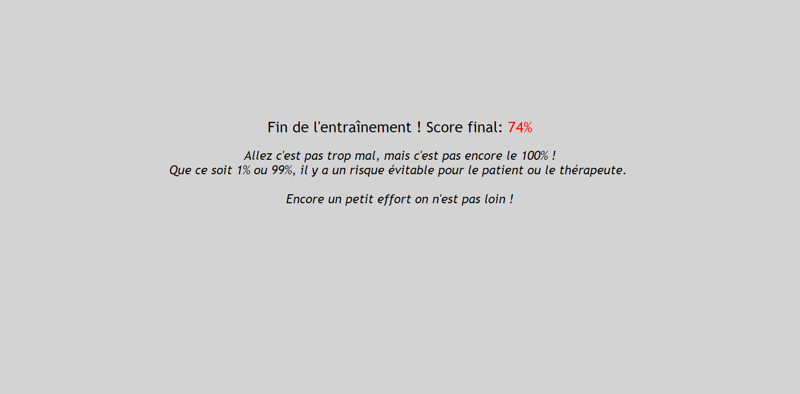  
  
#### IV.1.2) Further informations:
By default, **you have to answer to 5 questions to get a final score**, 5 questions that are taken randomly in all the questions written in the quizzes.js file.  
  
**If your quizzes.js file have less than 5 questions** you will have to answer to all questions that are in the file to get a score, it is self managed !  
  
However, it is **5 questions by default, but you can modify this** by adding `?n=X` at the end of the url and pressing entry to train with 1, 2, 3, ..., all questions in the quiz. If you enter a number greater than the number of questions available, it will set a number equal to the number of the questions, it is self managed !  
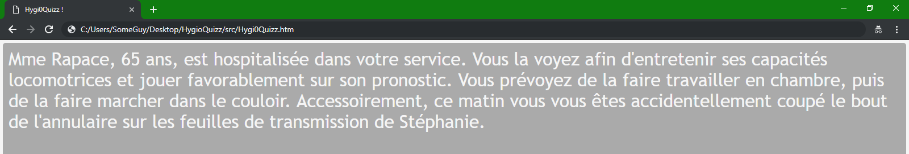  
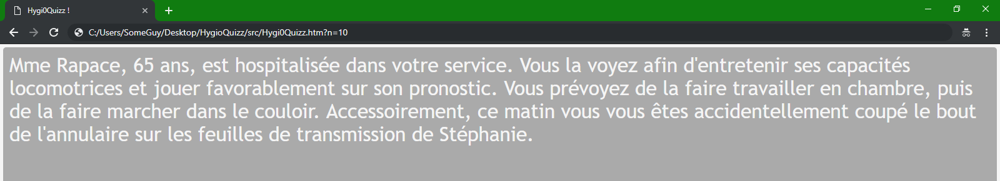  
  
### IV.2) Use CheckQuizzes feature:
This is a file to **see all the questions and answers stored in quizzes.js**, useful if you want to check the questions in a prettier view than directly in the quizzes.js file.  
  
You launch it by clicking on **yourFolder/HygioQuizz/src/CheckQuizzes.htm**, that will launch it into your web browser and show the first question of the quizzes.js file (question 0).  
  
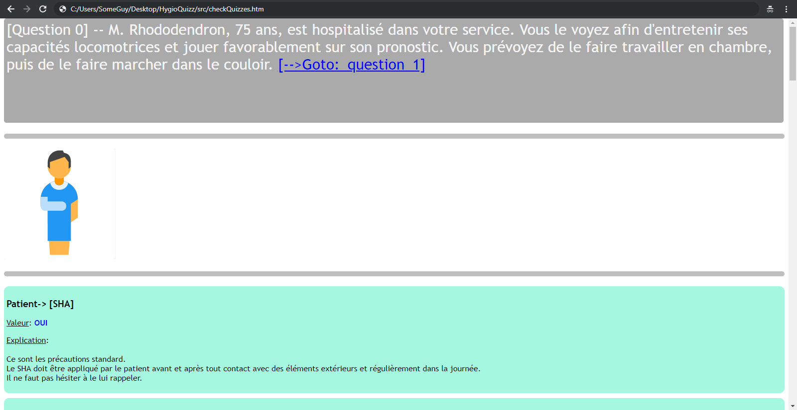  
  
  
**To see the next question and answers**, you click on the link "Goto question X".  
  
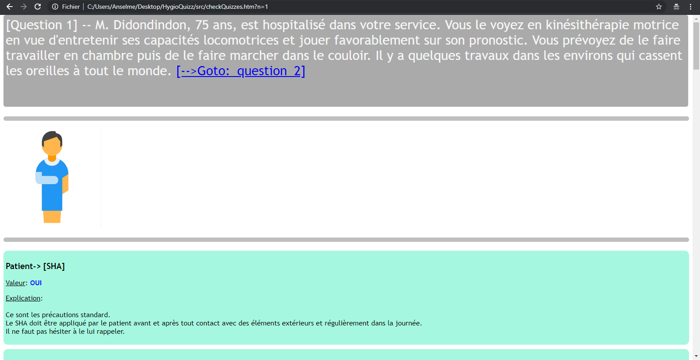  
  
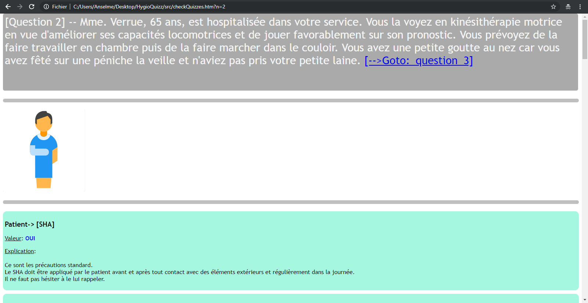    

#### Important final thing
Technically, the index of the question shown in the page is the value of `$_GET['n']`, **so to see directly question number K**, just add `?n=K` at the end of the url in the browser and press enter.
